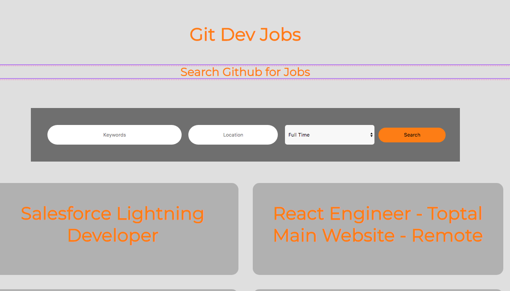

# Project Name / Title
<<<<<<< HEAD
 > Git Dev Jobs
=======
>>>>>>> a7e0f5caa221041f267c6cac78ccc658d23ca270

> Git Jobs

## 2 - 3 Sentence Project Description (Elevator Pitch)

> Search Github Jobs for Location based positions.

## What is your motivation for creating this project?

> Learn to code.

## How will users interact with your web site?

> Search form
<<<<<<< HEAD
    // Job Discription - { }

    // Country, State, Town/City, Postcode.{X}

    // Position type {Fulltime, Part Time, Contract/temp, Other} {X}
       
=======

    // Job Discription - {x}

    // Country, State, Town/City, Postcode.{X}

    // Position type {Fulltime, Part Time, Contract/temp, Other}
>>>>>>> a7e0f5caa221041f267c6cac78ccc658d23ca270

## What 3rd Party API(s) will you integrate with?

- https://jobs.github.com/api

## Tech Stack
<<<<<<< HEAD
 ### HTML CSS and JS
* CSS Framework you will use - or no framework
* Any 3rd party JS libraries like maps, data viz etc.

## Will you try to implement any stretch features?

* Possibly add node.js in the back-end so i can stop running a cors extention.

## What will be your process?

## What project management tool will you use?
    GitHub 
    readme.md file
    TODO.md file
## How often will you commit your code?
    Commited to Github after every stream.
## Testing
    - User Tests
* 
=======

- CSS Framework you will use - or no framework
- Any 3rd party JS libraries like maps, data viz etc.

## Will you try to implement any stretch features?

-

## What will be your process?

- What project management tool will you use?
- How often will you commit your code?
- How will you test your web site?
-

>>>>>>> a7e0f5caa221041f267c6cac78ccc658d23ca270
How will you design the layout of your website? Will you use a wireframing tool? Will you draw it on paper?

    ** https://wireframe.cc/FU9CTM  **
    
